fix it for me # Weather Report CI/CD Pipeline (Capstone Project)

A small end-to-end DevOps project. A Python script reports the weather for **any city in the world**. The code lives in GitHub, **Jenkins** runs it on demand, **Ansible** delivers a **Splunk-generated report** to a QA server, and a dedicated **10G filesystem** hosts the cloned repository.

> **Notes**
> - **GitHub** is used as the central repository (the assignment text mentions GitLab).
> - The repository is named `weather_report`.
> - The dedicated 10G `weather_report` filesystem is on **`qaserver`**.

---

## Table of contents

1. [Architecture](#architecture)
2. [Environment](#environment)
3. [Question 1: Architect plan](#question-1-architect-plan)
4. [Question 2: 10G filesystem and repository](#question-2-10g-filesystem-and-repository)
5. [Question 3: Splunk, report, Ansible and Jenkins](#question-3-splunk-report-ansible-and-jenkins)
6. [The weather script](#the-weather-script)
7. [Question 4: Incident response plan](#question-4-incident-response-plan)
8. [Problems I faced and how I fixed them](#problems-i-faced-and-how-i-fixed-them)
9. [Final result](#final-result)
10. [Screenshot checklist](#screenshot-checklist)

---

## Architecture

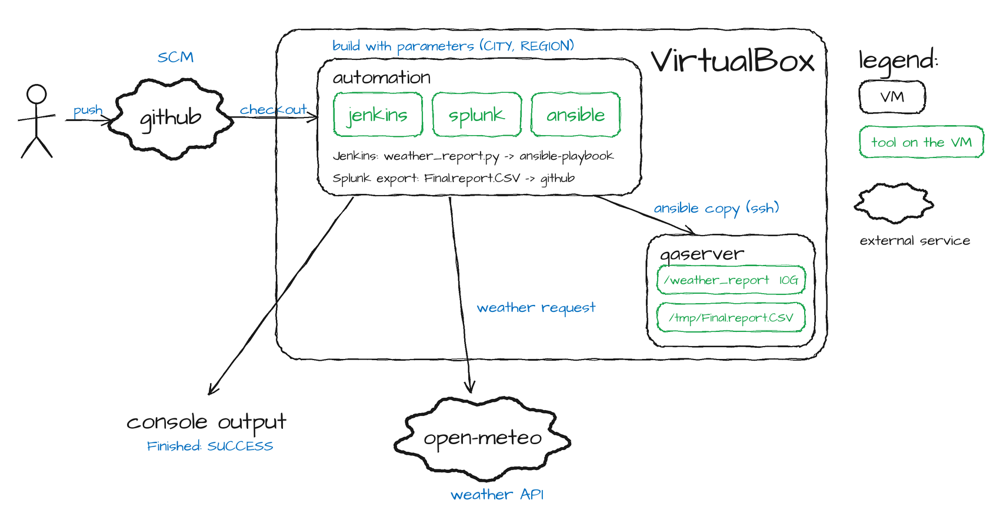

*The person pushes code to GitHub (SCM). A Jenkins build, started with the `CITY` and `REGION` parameters, checks the code out on the `automation` VM, runs `weather_report.py` (which calls the Open-Meteo weather API) and then the Ansible playbook, which copies `Final.report.CSV` to `/tmp` on `qaserver`. The repository is cloned into the 10G `/weather_report` filesystem on `qaserver`. Splunk (also on `automation`) produces `Final.report.CSV`, which is committed to GitHub. Jenkins shows the results in its console output.*

**Repository contents**

| File | Purpose |
|---|---|
| `architecture.png` | Architecture diagram shown above |
| `weather_report.py` | Prints the weather for any city, with its local time |
| `Final.report.CSV` | Report exported from the Splunk index `weather_index_report` |
| `copy_report.yml` | Ansible playbook that copies `Final.report.CSV` to `/tmp` on `qaserver` |
| `Incident_Response_Plan.pptx` | 3-slide incident response presentation (Question 4) |

---

## Environment

| Item | Value |
|---|---|
| Virtualization | Oracle VM VirtualBox |
| `automation` | Linux VM running Jenkins, Ansible and Splunk |
| `qaserver` | Linux VM (Ubuntu), the target server; hosts the 10G `weather_report` filesystem |
| Source control | GitHub: `https://github.com/cool129/weather_report` |
| Automation | Jenkins (Freestyle job `weather_report2`) and Ansible |
| Editor | VS Code on Windows (Git Bash terminal), WinSCP for file transfer |

---

## Question 1: Architect plan

Requirements: host the weather monitoring software on a virtual server, keep the script in a central repository (CI/CD concept), and run it daily with a suitable automation tool.

1. **Provision the servers.** Two Linux virtual servers in VirtualBox: `automation` (Jenkins, Ansible, Splunk) and `qaserver` (the QA target).
2. **Create the dedicated filesystem.** Attach a 10G virtual disk to `qaserver`, format it as ext4, mount it at `/weather_report`, and make the mount permanent in `/etc/fstab`.
3. **Set up the central repository.** Create the GitHub repository and push the script, the playbook and the report.
4. **Clone the repository** into the `/weather_report` filesystem on `qaserver`.
5. **Ingest and report in Splunk.** Create the `weather_index_report` index, ingest the dataset, run the search and export `Final.report.CSV`.
6. **Prepare Ansible.** Add `qaserver` to the inventory and write `copy_report.yml`.
7. **Automate with Jenkins.** A Freestyle job pulls the code from GitHub, runs the weather script and runs the playbook. Jenkins is the automation tool, so an intern can run it with one click (or on a schedule).
8. **Verify end to end.** The build ends in `Finished: SUCCESS` and the file exists in `/tmp` on `qaserver`.

---

## Question 2: 10G filesystem and repository

### 2.1 Attach and identify the disk

A 10G virtual disk was attached to `qaserver`. `lsblk` shows it as `sdc` with no mount point.

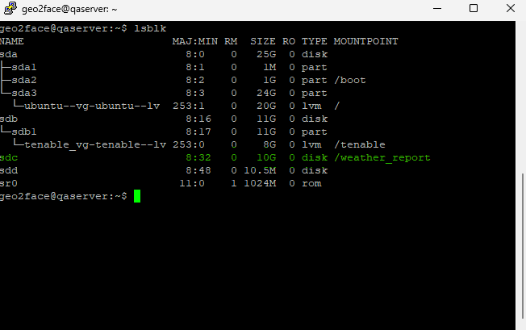

### 2.2 Format and mount at `/weather_report`

```bash
sudo blkid /dev/sdc                      # check whether it already has a filesystem
sudo mkfs.ext4 -L weather_report /dev/sdc   # only if blkid printed nothing
sudo mkdir -p /weather_report
sudo mount /dev/sdc /weather_report
sudo chown geo2face:geo2face /weather_report
df -h /weather_report
```

Result: `/dev/sdc` shows about 9.8G (the 10G disk, minus ext4 overhead) mounted on `/weather_report`.

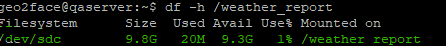

### 2.3 Make the mount permanent

```bash
sudo blkid /dev/sdc            # copy the UUID
echo 'UUID=<uuid>  /weather_report  ext4  defaults  0  2' | sudo tee -a /etc/fstab
grep -c weather_report /etc/fstab        # must print 1 (no duplicate)
sudo umount /weather_report && sudo mount -a && df -h /weather_report
```

<!-- add later:  -->

### 2.4 Create the GitHub repository and clone it into the filesystem

1. Created the repository `weather_report` on GitHub and uploaded `weather_report.py`, `copy_report.yml` and `Final.report.CSV`.
2. Cloned it **inside** the 10G filesystem on `qaserver`:

```bash
cd /weather_report
git clone https://github.com/cool129/weather_report.git
ls -l weather_report
```

<!-- add later:  -->

<!-- add later:  -->

---

## Question 3: Splunk, report, Ansible and Jenkins

### 3.1 Splunk index and report

1. Created the index `weather_index_report` (**Settings, then Indexes, then New Index**).

   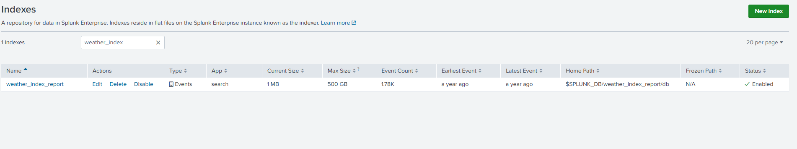

2. Ingested the provided dataset into that index (**Settings, then Add Data, then Upload**).

   <!-- add later:  -->

3. Ran the required search:

   ```
   index = weather_index_report
   ```

   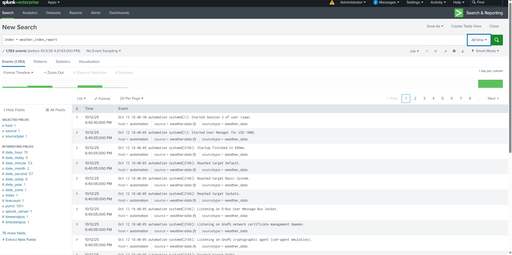

4. Exported the results as CSV and named the file exactly `Final.report.CSV`. The export has **1,783 events**, all from `index=weather_index_report` with sourcetype `weather_data`.

   <!-- add later:  -->

5. Committed `Final.report.CSV` to GitHub.

### 3.2 Ansible: inventory and playbook

Inventory on `automation` (`/etc/ansible/hosts`) contains:

```ini
qaserver ansible_host=192.168.1.147 ansible_user=geo2face
```

Connectivity check:

```bash
ansible qaserver -i /etc/ansible/hosts -m ping
```

<!-- add later:  -->

Playbook `copy_report.yml`:

```yaml
---
- name: Deliver weather report CSV to qaserver
  hosts: qaserver
  gather_facts: no

  tasks:
    - name: Copy Final.report.CSV into /tmp
      copy:
        src: Final.report.CSV
        dest: /tmp/Final.report.CSV
        mode: '0644'
```

Manual test run from `automation`:

```bash
ansible-playbook -i /etc/ansible/hosts copy_report.yml
```

<!-- add later:  -->

### 3.3 Jenkins job

Freestyle project `weather_report2`:

- **Source Code Management:** Git, `https://github.com/cool129/weather_report.git`, branch `*/main`
- **This project is parameterized:** string parameters `CITY` (default `Arlington`) and `REGION` (default `Texas`)
- **Build step (Execute shell):**

```bash
python3 weather_report.py "$CITY" "$REGION"
ansible-playbook -i /etc/ansible/hosts copy_report.yml
```

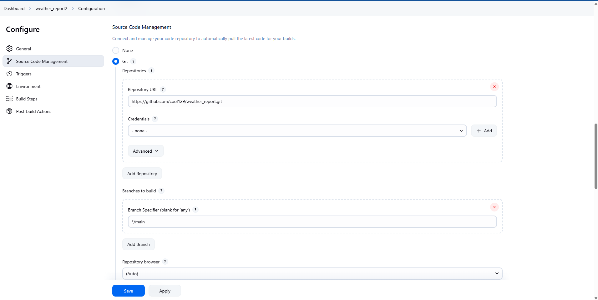

<!-- add later:  -->

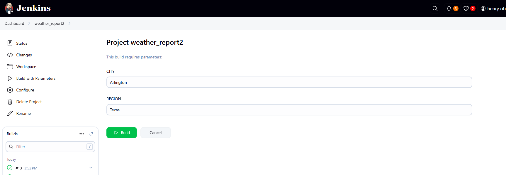

Jenkins runs as the `jenkins` user, so that user was given SSH access to `qaserver`:

```bash
sudo -u jenkins mkdir -p /var/lib/jenkins/.ssh
sudo -u jenkins ssh-keygen -t rsa -N "" -f /var/lib/jenkins/.ssh/id_rsa
sudo -u jenkins ssh-copy-id geo2face@192.168.1.147
sudo -u jenkins ssh geo2face@192.168.1.147 hostname     # prints: qaserver
```

### 3.4 Proof that Jenkins delivered the file

1. Deleted the file on `qaserver` so the job had to recreate it:

   ```bash
   rm /tmp/Final.report.CSV
   ls -l /tmp/Final.report.CSV      # No such file or directory
   ```

   <!-- add later:  -->

2. Ran the Jenkins job. The console shows the weather report, then `ok=1 changed=1 failed=0` and `Finished: SUCCESS`.

   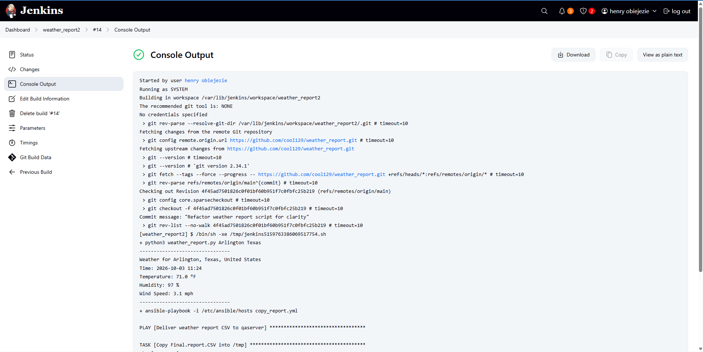

<!-- add later:  -->

   <!-- add later:  -->

3. Checked on `qaserver`:

   ```bash
   ls -l /tmp/Final.report.CSV      # 717764 bytes
   ```

   <!-- add later:  -->

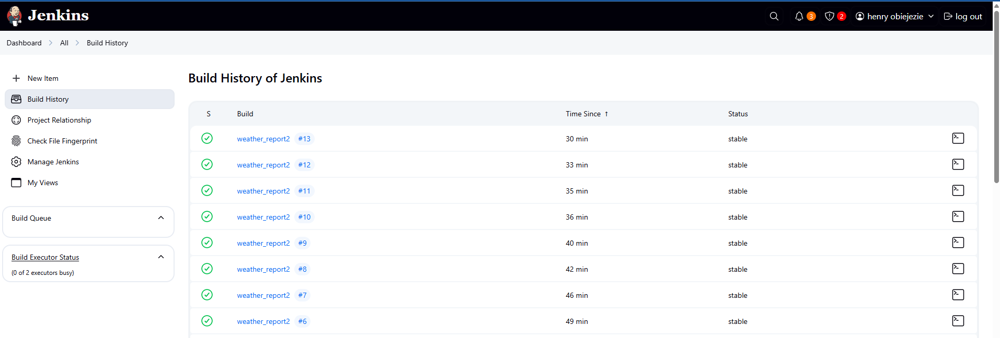

---

## The weather script

`weather_report.py` uses only the Python standard library (no `pip install` needed) and the free [Open-Meteo](https://open-meteo.com/) APIs (no API key).

**Usage**

```bash
python3 weather_report.py                      # default: Arlington, Texas
python3 weather_report.py Lagos Nigeria
python3 weather_report.py Paris France
python3 weather_report.py "New York" "New York"
python3 weather_report.py Dallas Texas
```

**How it works**

- The first argument is the **city**. Everything after it is the **state or country** (full names such as `Texas` or `Nigeria`, not abbreviations), which picks the right city when names repeat (Arlington, Texas vs Arlington, Virginia).
- It looks up the city's coordinates with the Open-Meteo geocoding API, then requests the current temperature, humidity and wind speed.
- US places are shown in **°F and mph**; everywhere else in **°C and km/h**.
- The `Time:` line shows the **current local time of the chosen city**, calculated from the UTC offset returned by the API.
- Blank arguments fall back to Arlington, Texas. If the city cannot be found, the script prints `Weather report failed: city not found: ...` and exits with code 1, so Jenkins marks the build as failed.

**Example output**

```
--------------------------------
Weather for Arlington, Texas, United States
Time: 2026-10-03 10:43
Temperature: 70.4 °F
Humidity: 97 %
Wind Speed: 4.7 mph
--------------------------------
```

---

## Question 4: Incident response plan

A 3-slide presentation (`Incident_Response_Plan.pptx`) for this scenario: a Finance employee opens an "Updated Invoice.pdf" attachment from an email that appears to come from a regular supplier. Hours later, monitoring shows connections from unexpected ports and IPs, unexpected connections to the Automation and prod servers, and files being modified unusually quickly.

| Slide | Content |
|---|---|
| 1. Identification | Scenario summary, the three indicators observed by IT Security, and the initial assessment (suspected phishing attachment with activity reaching the Automation and prod servers) |
| 2. Response | **Containment** (isolate the workstation, block the unexpected IPs and ports, restrict the Automation and prod servers, reset credentials), **Eradication** (quarantine the attachment, remove the email, scan the systems, scope the modified files) and **Recovery** (rebuild the workstation, restore clean files, verify servers, keep enhanced monitoring) |
| 3. Communication and prevention | Escalation and notification, confirming the invoice with the real supplier, a post-incident review, phishing awareness training and email attachment filtering |

<!-- add later:  -->

---

## Problems I faced and how I fixed them

| # | Problem | Cause | Fix |
|---|---|---|---|
| 1 | The assignment says GitLab, but I use GitHub | Different Git hosting platform | Used GitHub as the central repository and documented it |
| 2 | The new virtual disk was only **10.45 MB** | The size unit in VirtualBox was left on MB instead of GB | Noticed it in the VirtualBox storage settings; used the existing 10G disk (`sdc`) and left the tiny one unused |
| 3 | `df -h /weather_report` showed the **root disk** | `/weather_report` was only a normal folder; the disk was not mounted | Mounted `/dev/sdc` on `/weather_report` |
| 4 | The mount disappeared after testing | No entry in `/etc/fstab` | Added an entry by UUID and tested with `umount` and `mount -a` |
| 5 | The repo was cloned into my home folder | The `git clone` ran from `~`, not from `/weather_report` | Deleted that copy and cloned again from inside `/weather_report` |
| 6 | The report file was named `Final.report.CSV.csv` | A double extension | Renamed it to exactly `Final.report.CSV` |
| 7 | `ansible-playbook: command not found` in VS Code | The terminal was Git Bash on Windows, where Ansible is not installed | Edited files on Windows, pushed to GitHub and ran Ansible on the Linux `automation` server |
| 8 | `Unable to parse inventory.ini` and `provided hosts list is empty` | The custom inventory file was missing or malformed on that server | Used the existing `/etc/ansible/hosts` inventory instead |
| 9 | `UNREACHABLE ... No route to host` | The inventory had an old IP address for `qaserver` | Found the real IP with `hostname -I` and `ping`, then updated the inventory |
| 10 | `ERROR! no action detected in task` | The playbook used `ansible.builtin.copy`, which this older Ansible version did not accept, and `tasks:` was indented incorrectly | Changed it to `copy:` and fixed the indentation |
| 11 | Edited the playbook on GitHub but the server still had the old file | A cloned copy only changes after `git pull` | Ran `git pull origin main` |
| 12 | `Could not match supplied host pattern` and `no hosts matched` | The playbook was run on `qaserver`, whose inventory calls the host `qa_server`; the `qaserver` entry is in the inventory on `automation` | Ran the playbook from `automation`, where Ansible and Jenkins live |
| 13 | A stray `copy_report.yml` was in `/tmp` on `qaserver` | It was uploaded there by hand with WinSCP | Deleted it. Only `Final.report.CSV` should be delivered, by Jenkins |
| 14 | Jenkins: `Permission denied (publickey,password)` | Jenkins runs as the `jenkins` user, which had no SSH key on `qaserver` | Generated a key for `jenkins` and installed it with `ssh-copy-id` |
| 15 | Wrong Jenkins command | `python3 weather_report.py` was typed on the same line as `ansible-playbook`, so it was passed as extra arguments | Put each command on its own line |
| 16 | Weather script failed with `'results'` | A blank city came from Jenkins and the city lookup returned no `results` field | Ignored blank arguments (default Arlington, Texas) and added a clear `city not found` error |
| 17 | No **Build with Parameters** button in Jenkins | The job was not yet parameterized | Ticked **This project is parameterized** and added `CITY` and `REGION` |
| 18 | `git pull` failed with `not a git repository` | The folder came from **Download ZIP** and had no `.git` folder | Uploaded the updated file through the GitHub website (or clone with `git clone`) |
| 19 | The wind unit showed `mp/h` | The weather API's label for miles per hour | Replaced it with `mph` in the script |
| 20 | The temperature (84.9 °F) did not match Google (83 °F) | Open-Meteo gives a model estimate for the exact coordinates, while Google uses a nearby station reading at a slightly different time | Not a bug; documented as expected behavior |
| 21 | The `Time:` line did not match my clock | The server's clock was shown first, then the 15-minute data timestamp | Calculated the city's current local time from `utc_offset_seconds` |
| 22 | VS Code showed `qaserver: Unknown word` | The Spell Checker extension, not a YAML error | Ignored it |

### Screenshots of the main problems

<!-- add later:  -->

<!-- add later:  -->

<!-- add later:  -->

<!-- add later:  -->

<!-- add later:  -->

<!-- add later:  -->

<!-- add later:  -->

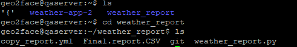

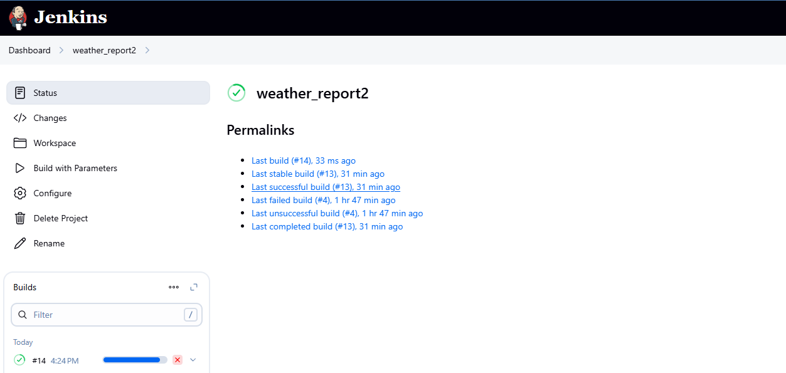

---

## Final result

- The **10G filesystem** is mounted permanently at `/weather_report` on `qaserver`, and the repository is cloned inside it.
- The **GitHub** repository holds the weather script, the Ansible playbook and the Splunk report.
- **Splunk** holds the `weather_index_report` index, and `Final.report.CSV` was exported from it.
- A **Jenkins job** pulls the code from GitHub, prints the weather for any city entered in the form, and runs an **Ansible playbook** that copies `Final.report.CSV` to `/tmp` on `qaserver`.
- The build finishes with `Finished: SUCCESS`, and `ls -l /tmp/Final.report.CSV` on `qaserver` confirms the delivery.

### Possible improvements

- Add a Jenkins **Build periodically** trigger (for example `H 8 * * *`) to run the report automatically every day.
- Store the weather report output as a Jenkins build artifact.
- Give `qaserver` a static IP or DHCP reservation, so the inventory does not break when the address changes.

---

## Screenshot checklist

Upload your screenshots to the repository (same folder as this README) using these exact names, and the images above will appear on GitHub.

| File name | What to capture |
|---|---|
| `01-lsblk-disks.png` | `lsblk` on `qaserver` showing the 10G `sdc` |
| `02-df-weather-report-mounted.png` | `df -h /weather_report` showing `/dev/sdc` |
| `03-fstab-entry.png` | The `/etc/fstab` line, and the successful `mount -a` test |
| `04-git-clone-weather-report.png` | The clone inside `/weather_report` with `ls -l` |
| `05-github-repo-files.png` | The GitHub repository page |
| `06-splunk-index-created.png` | The `weather_index_report` index in Splunk |
| `07-splunk-data-upload.png` | The data upload into the index |
| `08-splunk-search-results.png` | The search `index = weather_index_report` with results |
| `09-splunk-export-csv.png` | The export dialog or the exported file |
| `10-ansible-ping-pong.png` | `ansible qaserver -m ping` returning `pong` |
| `11-ansible-playbook-run.png` | The manual playbook run with `failed=0` |
| `12-tmp-file-before-delete.png` | `ls -l /tmp/Final.report.CSV` saying "No such file" |
| `13-jenkins-job-config.png` | The Jenkins job configuration (SCM, parameters, build step) |
| `15-jenkins-build-with-parameters-form.png` | The Build with Parameters form |
| `16-jenkins-console-success.png` | Console output with `Finished: SUCCESS` |
| `17-jenkins-console-other-country.png` | Console output for another country |
| `18-qaserver-tmp-file.png` | `ls -l /tmp/Final.report.CSV` showing the file |
| `20-jenkins-build-history.png` | The Jenkins build history showing the stable builds |
| `19-ir-deck-slides.png` | The three Question 4 slides |
| `16a-jenkins-console-weather-output.png` | Console output showing the weather report and the playbook starting |
| `t8-clone-in-home-folder.png` | The clone that ended up in the home folder (problem 5) |
| `14-jenkins-job-page.png` | The job page with **Build with Parameters** in the menu (problem 17) |
| `t1` to `t7` files | The problem screenshots listed in the troubleshooting section |
